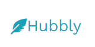

## Table of contents

[Hubbly](https://github.com/RafaelFernandez/wslt)  
[Tech Stack](#tech-stack)  
[Running Hubbly](#running-hubbly)  
[Developers Team](#developers-team)  
[Contributors](#contributors-✨)

# Hubbly - Websites for language teachers

<!-- ALL-CONTRIBUTORS-BADGE:START - Do not remove or modify this section -->

<!-- ALL-CONTRIBUTORS-BADGE:END -->

 

Hubbly is an app that makes websites for English language teachers. Designed, pitched, created and delivered a fully-functioning web-app. Built app features ensuring that they complied and fulfilled the associated user story. Created and prioritised the backlog for the tech team.

Once you're logged in start by selecting a specific template - then you would be able to select the content you wish for each section and when ready just launch and start getting more students...!

## Teaser:

 

## Tech Stack

### CI / CD

- [Github](https://github.com/features/actions)
- [Trello](https://trello.com)

### Hosting

- [Heroku](https://heroku.com) for Frontend and Backend

### Authentication

- Pundit with bcrypt

## Running Hubbly

`$ bundle`

**Contributing**
- Fork it
- Create your feature branch (git checkout -b my-new-feature)
- Commit your changes (git commit -am 'Added some feature')
- Push to the branch (git push origin my-new-feature)
- Create new Pull Request

**Note!**
  Adjust the necessary env variables to match your system and make sure you have postgreSQL installed on your machine [mac](https://www.postgresql.org/download/macosx/) || [windows](https://www.postgresql.org/download/windows/)  

## Developers Team

😋  German - [Github](https://github.com/geuxor) - [LinkedIn](https://www.linkedin.com/in/german-b)\
🤠  Rafael - [Github](https://github.com/RafaelFernandez) - [LinkedIn](https://www.linkedin.com/in/rafaelfernandezo)\
🥳  Poppy - [Github](https://github.com/PoppyJennings) - [LinkedIn](https://www.linkedin.com/in/poppyjennings)\
😂  Mai - [Github](https://github.com/mai-c-nguyen) - [LinkedIn](https://www.linkedin.com/in/mai-c-nguyen)

## Contributors ✨

Thanks goes to these wonderful people ([💝 ](https://allcontributors.org/docs/en/emoji-key)):

<!-- ALL-CONTRIBUTORS-LIST:START - Do not remove or modify this section -->
<!-- prettier-ignore-start -->
<!-- markdownlint-disable -->
<table>
  <tr>
  <td align="center"><a href="http://www.linkedin.com/in/german-b">
    <b>German</b></a> 
   <a href="#infra-gexuor" title="Infrastructure (Hosting, Build-Tools, etc)">🚇</a> 
   <a href="https://github.com/RafaelFernandez/wslt/commits?author=geuxor" title="Code">💻</a></td>

   <td align="center"><a href="https://www.linkedin.com/in/sebastiangreen13/"> <b>Rafael</b></a> 
   <a href="#infra-RafaelFernandez" title="Infrastructure (Hosting, Build-Tools, etc)">🚇</a> 
    <a href="https://github.com/RafaelFernandez/wslt/commits?author=RafaelFernandez" title="Code">💻</a></td>
    
   <td align="center"><a href=""> <b>Poppy</b></a> <a href="#infra-PoppyJennings" title="Infrastructure (Hosting, Build-Tools, etc)">🚇</a> <a href="https://github.com/RafaelFernandez/wslt/commits?author=PoppyJennings" title="Code">💻</a></td>
   
   <td align="center"><a href=""> <b>Mai</b></a> <a href="#infra-" title="Infrastructure (Hosting, Build-Tools, etc)">🚇</a> <a href="https://github.com/RafaelFernandez/wslt/commits?author=mai-c-nguyen" title="Code">💻</a></td>
  
 </tr>
</table>

<!-- markdownlint-enable -->
<!-- prettier-ignore-end -->
<!-- ALL-CONTRIBUTORS-LIST:END -->

This project follows the [all-contributors](https://github.com/all-contributors/all-contributors) specification. Contributions of any kind welcome!
